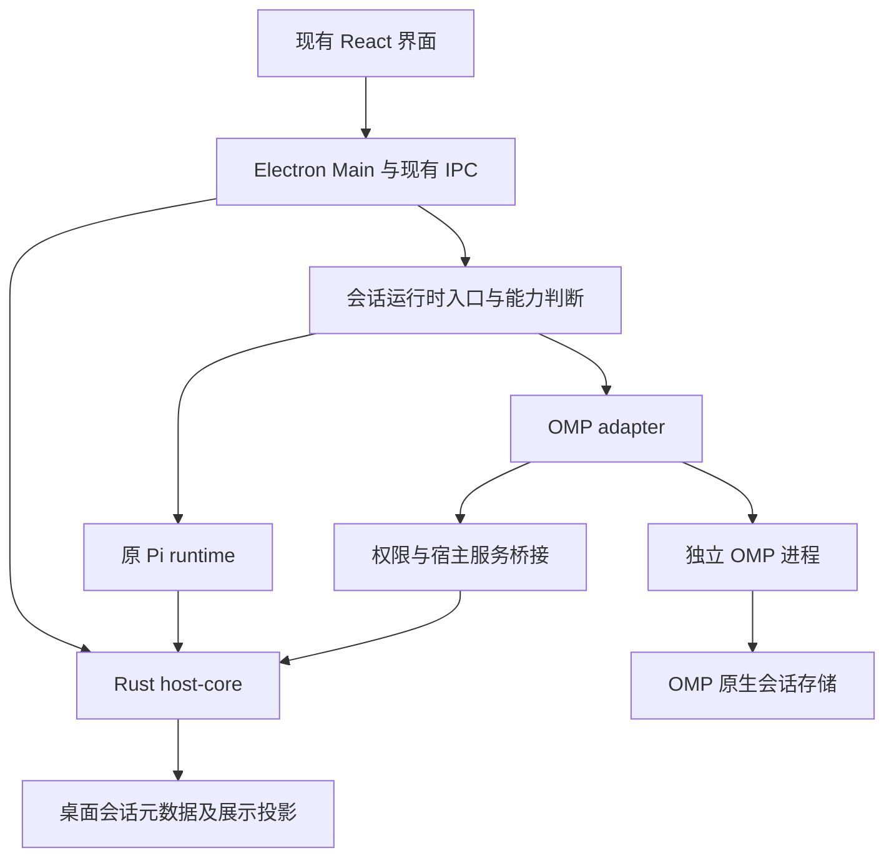

# 目标架构与实现路径

本文是拟实现设计。现有代码事实见 `01-source-audit.md`，最终接口选择必须通过 M1 实验。

## 1. 保留桌面，隔离引擎差异



图中的权限桥接是需要实现和验证的能力，不是普通 OMP RPC 已经具备的承诺。工具必须在 OMP 内部开始产生副作用前进入桥接；只在 Electron 收到工具开始事件后弹窗不构成阻断。

### 职责划分

| 层 | 保留或负责的内容 | 不应承担 |
| --- | --- | --- |
| React | 布局、输入、文本和工具展示、状态、审批交互 | 直接创建 OMP 进程、读取密钥、决定权限 |
| Electron Main | 进程监督、IPC、会话路由、配置读取 | 另写一套 Agent 循环 |
| 桌面运行时入口 | 选择引擎、统一必要的会话命令和事件 | 把所有 OMP 特性压缩成 Pi 的最小能力 |
| OMP adapter | 协议编解码、事件转换、状态归并、生命周期与能力协商 | 复制 OMP 的工具实现、解析 TUI 文本 |
| OMP | 模型循环、原生工具、原生压缩/恢复、OMP 子代理 | 与桌面另一个编排器重复执行同一任务 |
| Rust host-core | 桌面元数据、原有宿主能力、可复用的权限政策 | 默认宣称约束 OMP 内部所有文件和进程操作 |

## 2. 三条接入路径的选择

### A. OMP 原生 RPC，优先实验 rpc-ui

由监督器直接启动锁定版本的 OMP，使用结构化 stdin/stdout 协议。适合尽快验证消息、事件、停止、模型切换和会话操作。

本地源码已确认 `rpc-ui` 才会给完整工具会话设置 UI 能力，且 OMP 原有 wrapper 支持执行前审批。生产候选优先使用 rpc-ui，结合原有审批与受信 `tool_call` 扩展桥接；普通 rpc 保留为对照实验。不要为让工具执行而将审批模式统一改成 yolo。

须逐项确认：命令定义、应答时机、交互式问题、工具结果结构、取消语义、会话路径和认证配置。PI-Desktop sidecar 的 NDJSON JSON-RPC 与 OMP 的命令协议不能直接相连，必须转换。

### B. 独立 SDK bridge，A 无法满足关键能力时采用

在独立进程中使用 OMP 的完整会话 SDK，包装桌面需要的稳定协议，并通过经过确认的扩展/事件钩子接入审批和宿主服务。运行时采用该 OMP 版本支持的方式，优先保持其 Bun/原生模块环境。

使用完整 `createAgentSession` 等会话层入口的可用性要从实际 SDK 核对。仅换用 `@oh-my-pi/pi-ai` 或 `pi-agent-core` 不等于保留 OMP 的工具、LSP、任务编排和配置行为。

适配层依赖公开接口；若必须使用内部接口，在单独模块隔离并记录版本、原因、升级风险和替换条件。不要以此为由直接修改 OMP 参考仓库。

### C. ACP，仅在需求契合时评估

ACP 有编辑器协作和权限请求语义，可作为工具 I/O 路由的候选。先验证它是否暴露所需 OMP 特性、会话操作和事件，不假定它比 RPC 更完整。M1 最终只选择一条主要生产路径，避免同时维护三套后端。

### M1 决策门

满足基本消息和恢复，但无法在工具执行前阻断：只能作为受控实验，不进入面向用户的 MVP。

无法保持原沙箱语义：不得继续显示会让用户误以为已启用原沙箱的开关或文案。明确能力边界，并实现对应约束或暂不开放相关模式。

## 3. 拟新增模块

以下是建议名称，M2 应按现有目录约定调整并记录；不要预先重构整个代码库。

```text
app/packages/shared/src/agent-backend.ts
    最小引擎标识、能力和桌面 DTO
app/packages/omp-runtime/
    src/transport.ts        行协议、帧校验、请求关联
    src/process.ts          启动、关闭、退出和超时处理
    src/adapter.ts          命令与事件转换
    src/session-map.ts      桌面会话与原生会话关联
    src/permissions.ts      工具执行前审批桥接
    src/capabilities.ts     能力声明、版本判断
    test/                   协议和生命周期测试
app/packages/omp-runtime-bridge/
    仅选择 SDK 路线时创建，不与原生 RPC 路线重复建设
```

通用进程监督优先扩展现有 `packages/host-runtime/src/agent-sidecar.ts` 的责任边界，Electron 层只负责启动配置和路由。除非源码证明复用困难，不另外新增平行的 IPC、数据库或窗口管理服务。先评估 OMP 已有 `rpc-client.ts`、`rpc-frame.ts` 能否复用；不能导入时说明运行时依赖原因，并用契约测试保护独立实现。

## 4. 最小应用内接口

下列 TypeScript 是接口草案，不是 OMP 原生协议定义。字段在 M1 后落实；真实协议原样记录在脱敏 fixtures 中。

```ts
type EngineId = "pi" | "omp";

interface EngineCapabilities {
  resume: boolean;
  branch: boolean;
  steer: boolean;
  followUp: boolean;
  modelSwitch: boolean;
  structuredQuestions: boolean;
  toolApproval: boolean;
  subagentEvents: boolean;
}

interface SessionEngineRef {
  engine: EngineId;
  runtimeVersion: string;
  adapterVersion: number;
  nativeSessionId: string;
  nativeSessionPath?: string;
}
```

会话边界至少承载 `create/open`、`prompt`、`abort`、`dispose`、事件订阅和能力读取。只有证实支持后才添加 `steer`、`followUp`、`fork`、`compact` 等命令。

已有桌面 DTO 能用就复用，不为了“引擎抽象”复制所有类型。OMP 特有结构通过有类型的扩展载荷保留，通用 UI 对未知载荷有安全退化显示。

当前 `SessionSource` 是 `desktop | pi-native | remote`，表示 transcript 权威来源，与 `EngineId` 不是同一维度。新增引擎字段不得破坏现有 source、原生会话及远程路由语义。

## 5. 传输和事件处理

- 每个请求具有唯一 ID；命令被接受、命令应答和一次 Agent 回合结束是不同事件。
- stdout 只解析协议；stderr 进入限长、脱敏的诊断日志。无法避免的非协议输出按明确规则报告，不能静默吞掉所有解析错误。
- 按 `ready.supportedProtocolVersions` 协商，使用真实 `negotiate_protocol`；支持 v2 时处理 `rpc_chunk` 与重组上限，不把分片当作业务事件。
- NDJSON 必须处理半帧、多帧、UTF-8 跨块、CRLF、超大结果和非法 JSON；不假定一个 chunk 就是一条消息。
- 事件绑定 `desktopSessionId`、本次进程实例、`runId` 和顺序号；没有上游序号时由 adapter 生成，但不能宣称具有上游重放语义。
- 文本增量可合并刷新；工具开始、结束、审批和终止状态不能被节流丢失。
- 工具 ID、子代理 ID 和原生消息 ID 保留映射。未知工具首先使用结构化通用卡片，而不是直接丢弃。
- RPC 退出时拒绝所有挂起请求，关闭未完成审批，发出唯一终止状态。错误日志保留诊断信息但去除凭证和敏感环境值。

## 6. 生命周期与取消

建议应用状态：`starting -> idle -> running -> waiting_for_input/approval -> running -> idle`；异常进入 `failed`，取消进入 `cancelling -> cancelled`，关闭进入 `closing -> closed`。

这些是桌面归一化状态，不要求照搬 OMP 的内部枚举。

1. 启动：明确可执行文件、版本、工作目录、配置根和会话路径；验证运行时是否可用。
2. 就绪：使用真实支持的命令核对状态和模型。不要发明 `initialize` 命令。
3. 运行：请求接收不等于完成。回合结束以后才恢复空闲状态。
4. 用户停止：发送真实 abort，等待终止；超时后按进程树执行 TERM/KILL 等平台适配，不能只改变按钮。
5. 崩溃：标记中断并保留已有内容；不自动重新发送上一条可能产生副作用的 prompt。
6. 恢复：从原生已持久化状态恢复并校验项目身份，不重放旧审批或未确认的执行。
7. 晚到事件：旧 `runId` 的数据不得覆盖当前运行状态；保留必要的审计记录。

第一版可采用“一条活动会话对应一个 OMP 进程”的简单模型，并定义空闲退出和恢复。并发上限、内存占用和进程复用由实测决定。

## 7. 会话与存储

默认方案：OMP 是原生执行会话的权威来源；桌面维护索引和界面投影。M1 验证原生恢复入口后确认此方案。

桌面自己的 SQLite 仍只由 Rust host-core 管理。OMP 内部认证/配置/会话数据库由 OMP 进程独享，桌面通过协议访问；两类数据库不混为一个，也不让 renderer 或 Electron 直接读取 OMP 内部表。该职责变化需记录到产品 ADR。

桌面需记录：引擎、运行时/适配器版本、原生会话 ID/路径、项目 ID、固定工作目录、创建时间、活动运行状态和必要的展示元数据。

- 既有会话显式归属 `pi`，通过兼容迁移处理，不能被新默认引擎误接管。
- 新 OMP 会话使用应用自己的配置/会话目录；具体参数依据 OMP 源码确认。
- 不让 Rust 和 OMP 同时写同一份原生 transcript。
- 用桌面索引映射原生文件，而不是凭项目路径猜测“最近的一条会话”。
- 分支必须创建新的身份映射；删除或归档的产品语义明确区分，不默认删除原生文件。
- 不支持 Pi/OMP 原地切换继续同一个会话；将来需要时设计显式复制/转换流程。
- M4 处理旧库迁移的重复执行、失败恢复和向后兼容读取。

## 8. 权限与工具责任

OMP 原生 `read/edit/bash/task` 等应保留其实现，否则可能失去 hashline、内嵌 shell、子代理等价值。但它们需要在 OMP 一侧进入可验证的前置政策检查。

拟定链路：`OMP 工具即将执行 -> 受信 bridge 获取结构化请求 -> 宿主政策决策 -> 必要时 UI 审批 -> 绑定请求的结果回传 -> 允许后执行`。

审批必须绑定会话、运行、工具调用、规范化目标和作用域；拒绝、超时、窗口关闭、桥接断开默认不授权。更改工具参数之后必须重新检查。

覆盖要求包含子代理和后台任务。高层 `eval/browser/computer` 可在一次调用里执行复杂操作，只拦截外层工具名并不能声称具备原有的细粒度文件沙箱。M1/M5 分别证明可提供的约束；无法提供时不开放相应受限模式。

MCP 服务、插件工具、规则、记忆和子代理编排分别选定一个执行责任方。桌面插件中的纯面板/主题可优先保留；会调用 Pi 类型或注册 Agent 工具的插件必须走能力判断和适配。

## 9. 配置、凭证和应用隔离

- 桌面保持配置交互；adapter 只将所选会话必要的配置提供给 OMP。
- 优先使用受控进程输入或已验证 SDK 注入；不要在可见命令行拼 API Key。
- 不把完整 Electron 环境无筛选地传入；列出必须继承和必须排除的环境键名。
- 用户全局 OMP 配置、规则和凭证的自动发现行为必须核对；实验用独立目录，禁止无提示地混用。
- 开发版先隔离 userData、数据库、实际文件型凭证存储和更新源；如果使用系统密钥存储，也隔离其服务名，再做持久化或升级实验。
- 拟定开发标识可用 `OMP Desktop Dev` / `dev.ompdesktop.app`，正式品牌和发布标识留给用户确认；不得继续命中原 PI-Desktop 更新地址。

## 10. 上游更新策略

UI 修复从 PI-Desktop 参考子模块比较旧/新 SHA，将所需差异以 `app/` 为路径前缀应用到产品源码；不要将上游根目录直接合并到本项目根目录。OMP 先锁版本，每次单独升级并运行协议、权限、恢复和工具 fixtures。

不要求每次升级都追到上游最新。更新文档必须记录旧/新 SHA、变更原因、兼容性检查及回退方式。会话格式发生不可逆升级时，先备份再试，不将旧版本直接用于新格式数据。
